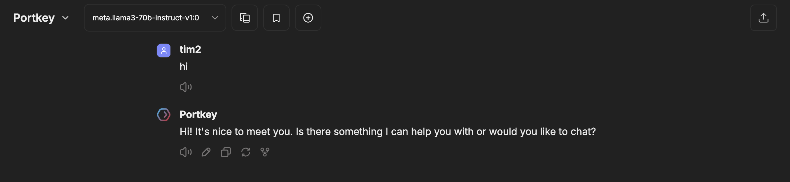
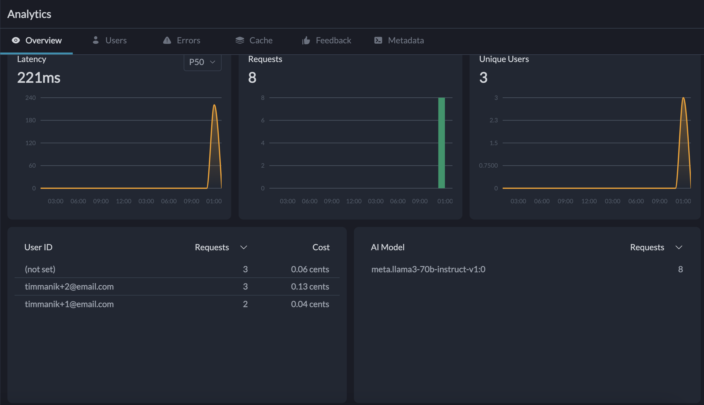

# librechat-for-portkey

[LibreChat](https://github.com/danny-avila/LibreChat) is an open source chat user interface for LLMs.

[Portkey](https://github.com/Portkey-AI/gateway) is a gateway for managing multiple LLMs (also called an LLM gateway).

Currently, LibreChat can use Portkey as an endpoint to send requests to. However, LibreChat is unable to send a unique identifier (ID, username, or email address) of the user to Portkey. This is much needed is needed since many admins, including myself, would like to see metrics (especially cost metrics) at the user level.

Since Portkey can track individual user usage via passing a unique user ID through HTTP headers, I went ahead and modified the way that LibreChat passes its header to custom endpoints (like Portkey). To see more info, jump ahead to [initialize.js](#initializejs).

With these modifications, every request made to the Portkey endpoint/gateway is associated with the user making that request (granted that the HTTP headers is defined accordingly in the [librechat.yaml](#librechatyaml) file). Portkey's dashboard now shows that timmanik@email.com made a request and spent X amount of cents on that request.

#### LibreChat chat interface


#### Portkey dashboard



## How can we get this to work?

Four files need to be modified to make this work:

- LibreChat/[`.env`](.env.example)
- LibreChat/[`librechat.yaml`](librechat.example.yaml)
- LibreChat/[`docker-compose.override.yml`](docker-compose.override.yml)
- LibreChat/api/server/services/Endpoints/custom/[`initializeClient.js`](api/initializeClient.js)

Below are notes about the additions/modifications that need to be made:

### [`.env`](.env.example)

Add the three Portkey variables listed in my file to your existing .env file (or wherever you host your secrets/params).

### [`librechat.yaml`](librechat.example.yaml)

Leave your existing librechat.yaml code as is up until the **custom:** key (i.e., where you specify your custom endpoints). Add an additional endpoint or modify your existing Portkey endpoint.

The most important part for our use case is adding the header `x-portkey-metadata: '{"_user": "${USER_EMAIL}"}'`.

The variable ${USER_EMAIL} was created and is referenced in the JavaScript code that processes the headers. This naming convention is currently supported by our custom [`initializeClient.js`](api/initializeClient.js) code.

This will add `x-portkey-metadata` as a header to the request to Portkey, passing in the email address of the user making the request in LibreChat.

### [`docker-compose.override.yml`](docker-compose.override.yml)

This specification tells docker compose to create docker images based on the local files.

We need to build the images from local files because we are making changes to the backend (`initializeClient.js`).

Additionally, we want to reference `librechat.yaml`, which we do with the following lines of code:

```yaml
    volumes:
      - type: bind
        source: ./librechat.yaml
        target: /app/librechat.yaml
```

### [`initialize.js`](api/initialize.js)

The most significant modifications were made to `initialize.js` (formerly named `initializeClient.js` up until [this commit](https://github.com/danny-avila/LibreChat/commit/20fb7f05aeae9712be42689646c2829c31aa92d4)). In the LibreChat repository, this file is located in `/api/server/services/Endpoints/custom/`.

#### Original code for the header processing
One of the functions of this file is to process the HTTP headers passed to the endpoints LibreChat is connected to. Below is the logic that handles this process.

```javascript
    let resolvedHeaders = {};
    if (endpointConfig.headers && typeof endpointConfig.headers === 'object') {
    Object.keys(endpointConfig.headers).forEach((key) => {
        resolvedHeaders[key] = extractEnvVariable(endpointConfig.headers[key]);
    });
    }
```
The code above would be able to process the HTTP headers below since the values for `${PORTKEY_API_KEY}` and `${PORTKEY_VIRTUAL_KEY}` are in the .env file and they are static
```http
x-portkey-api-key: "${PORTKEY_API_KEY}"
x-portkey-virtual-key: "${PORTKEY_VIRTUAL_KEY}"
```
However, the code would not be able to dynamically fetch the email address of each user as they are making a request to the endpoint, in this case portkey. This is due to the fact that `${USER_EMAIL}` is not a static variable and the context shoudld not be pulled from the .env file, but from elsewhere.
```http
x-portkey-metadata: '{"_user": "${USER_EMAIL}"}'
```

I attempt to solve this problem in the code below.

#### Updated code for header processing
The below code iterates over the headers in endpointConfig, and for each header that contains the ${USER_EMAIL} placeholder, it replaces it with the corresponding user's email fetched from the database.

For headers without ${USER_EMAIL}, it resolves any other environment variables using extractEnvVariable, and handles errors by assigning 'null' as a fallback.
```javascript
const User = require('~/models/User');    // Added to reference user information

    /**
     * ommited codeblock
    */

  // START OF TESTING CODEBLOCK FOR HEADER PROCESSING
  const replaceUserEmail = async (metadata, userId) => {    // function to replace ${USER_EMAIL} with the user's email
    try {
      const user = await User.findById(userId).exec();
      return user?.email && metadata.includes('${USER_EMAIL}')
        ? metadata.replace('${USER_EMAIL}', user.email)
        : metadata;
    } catch {
      throw new Error('User not found');
    }
  };

  let resolvedHeaders = {};
  if (endpointConfig.headers && typeof endpointConfig.headers === 'object') {
    await Promise.all(Object.entries(endpointConfig.headers).map(async ([key, value]) => {
      try {
        resolvedHeaders[key] = value.includes('${USER_EMAIL}')
          ? await replaceUserEmail(value, req.user.id)
          : extractEnvVariable(value);
      } catch {
        resolvedHeaders[key] = 'null'; // Fallback on error
      }
    }));
  }
  // END OF TESTING CODEBLOCK FOR HEADER PROCESSING
```

I advise creating a backup or renaming your current `initialize.js` file before copying the one in this repo to your local LibreChat repository.

#### Additional notes

Initially, I [hardcoded](./api/initializeClient.portkey.js) Portkey's specific HTTP header that needed the user email context.

It was a decent starting point, but I figured making it more modular is better to support other use cases (i.e. other custom endpoints) that need to get the user email context via HTTP headers.

When asking myself how this implementation can be better, I think one way is to define the Portkey endpoint in `api/server/services/Endpoints/`, similar to those already available for **Anthropic** or **Amazon Bedrock**.

I hope the `intialize.js` modifications I made can help with the Portkey + LibreChat intergration, and other use cases as well. Feel free to make a pull request or add in the discussions with comments/suggestions/questions.
